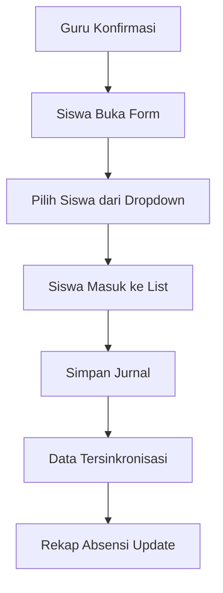

# 📋 Dropdown Absensi Siswa

> Fitur dropdown untuk memilih siswa yang tidak hadir dengan sinkronisasi otomatis ke rekap absensi

## 🎯 Tujuan

Mempermudah pengisian absensi siswa dengan interface dropdown yang user-friendly dan data yang lebih akurat dengan menyimpan detail siswa yang tidak hadir (ID, NIS, Nama).

## ✨ Fitur Utama

### 1. **Dropdown Pemilihan Siswa**
- Pilih siswa dari dropdown berdasarkan kategori (Sakit, Izin, Alpha)
- Menampilkan nama dan NIS siswa
- Sorted alphabetically untuk kemudahan pencarian
- Hanya menampilkan siswa aktif di kelas

### 2. **List Siswa Terpilih**
- Menampilkan daftar siswa yang tidak hadir per kategori
- Tombol hapus untuk menghapus siswa dari list
- Counter otomatis menghitung jumlah siswa
- Validasi duplikasi siswa antar kategori

### 3. **Sinkronisasi Rekap Absensi**
- Data siswa tersimpan dengan detail lengkap
- Rekap absensi otomatis membaca dari jurnal
- Riwayat ketidakhadiran per siswa
- Filter dan export data

## 🚀 Quick Start

### Untuk Siswa (Ketua/Sekretaris)

```
1. Login → Menu "Jurnal Hari Ini"
2. Klik "Isi Jurnal Sekarang"
3. Pilih siswa dari dropdown → Klik [+]
4. Isi materi pelajaran
5. Klik "Simpan Jurnal"
```

### Untuk Admin

```
1. Login → Menu "Rekap Absensi"
2. Pilih bulan dan filter
3. Lihat rekap ketidakhadiran
4. Klik [👁] untuk detail siswa
5. Export ke Excel/PDF
```

## 📊 Struktur Data

### Jurnal dengan Absensi Detail

```javascript
{
  id: "jrn_xxx",
  kelasId: "kls001",
  jadwalId: "jdw001",
  tanggal: "2026-05-14",
  materi: "Materi pelajaran",
  jumlahHadir: 23,
  jumlahSakit: 1,
  jumlahIzin: 1,
  jumlahAlpha: 0,
  absensi: {
    sakit: [
      { id: "siswa001", nis: "12345", nama: "Ahmad Fauzi" }
    ],
    izin: [
      { id: "siswa002", nis: "12346", nama: "Budi Santoso" }
    ],
    alpha: []
  }
}
```

## 🎨 Screenshot

### Form Isi Jurnal
```
┌─────────────────────────────────────────┐
│ Siswa Sakit                             │
│ ┌─────────────────────────┬───┐         │
│ │ -- Pilih Siswa Sakit -- │ + │         │
│ └─────────────────────────┴───┘         │
│                                         │
│ ┌─────────────────────────────────┐     │
│ │ Ahmad Fauzi (12345)         [×] │     │
│ │ Budi Santoso (12346)        [×] │     │
│ └─────────────────────────────────┘     │
└─────────────────────────────────────────┘
```

### Rekap Absensi
```
┌──────────────────────────────────────────────────┐
│ No │ Nama         │ Kelas │ S │ I │ A │ Total │
├────┼──────────────┼───────┼───┼───┼───┼───────┤
│ 1  │ Ahmad Fauzi  │ X-2   │ 2 │ 1 │ 0 │   3   │
│ 2  │ Budi Santoso │ X-2   │ 1 │ 0 │ 1 │   2   │
└──────────────────────────────────────────────────┘
```

## 🔧 Instalasi

Tidak perlu instalasi khusus. Fitur ini sudah terintegrasi dengan sistem yang ada.

### Requirement
- Data siswa sudah diimport
- Siswa sudah diassign ke kelas
- Jumlah siswa sudah tersinkronisasi

## 📖 Dokumentasi

### File Dokumentasi
- `FITUR_DROPDOWN_ABSENSI_SISWA.md` - Dokumentasi lengkap
- `CARA_ISI_ABSENSI_SISWA.txt` - Panduan singkat
- `QUICK_REFERENCE_DROPDOWN_ABSENSI.txt` - Quick reference
- `TESTING_CHECKLIST_DROPDOWN_ABSENSI.txt` - Testing checklist

### File Implementasi
- `js/siswa.js` - Logic utama
- `dashboard-siswa.html` - UI form
- `css/dashboard.css` - Styling
- `js/absensi.js` - Rekap absensi

## ⚠️ Validasi

### 1. Duplikasi Siswa
Siswa tidak bisa dipilih di lebih dari satu kategori.

```javascript
// ❌ TIDAK BOLEH
Sakit: [Ahmad]
Izin: [Ahmad]  // Error: Ahmad sudah ada di list Sakit!
```

### 2. Total Siswa
Total tidak hadir tidak boleh melebihi jumlah siswa di kelas.

```javascript
// ❌ TIDAK BOLEH
Total Siswa: 25
Sakit: 10
Izin: 10
Alpha: 10
Total Tidak Hadir: 30  // Error: Melebihi jumlah siswa!
```

### 3. Materi Wajib
Materi pelajaran harus diisi.

```javascript
// ❌ TIDAK BOLEH
Materi: ""  // Error: Materi wajib diisi!
```

## 🔄 Alur Kerja



## 💡 Tips & Tricks

### 1. Pencarian Cepat
Dropdown support native browser search. Ketik nama siswa untuk mencari cepat.

### 2. Keyboard Navigation
- `Tab` - Pindah antar field
- `Enter` - Pilih siswa dari dropdown
- `Esc` - Tutup modal

### 3. Bulk Selection
Untuk memilih banyak siswa, gunakan dropdown berulang kali tanpa perlu scroll ke atas.

## 🐛 Troubleshooting

### Dropdown Kosong

**Problem:** Dropdown tidak menampilkan siswa

**Solution:**
1. Pastikan data siswa sudah diimport
2. Cek siswa sudah diassign ke kelas yang benar
3. Pastikan siswa dalam status aktif

```javascript
// Debug: Cek data siswa
const siswa = dbGetAll(DB_KEYS.siswa).filter(
  s => s.kelasId === currentSession.kelasId && s.aktif
);
console.log(siswa);
```

### Siswa Tidak Bisa Dipilih

**Problem:** Siswa tidak bisa ditambahkan ke list

**Solution:**
1. Cek apakah siswa sudah ada di kategori lain
2. Cek console untuk error message
3. Refresh halaman dan coba lagi

### Data Tidak Muncul di Rekap

**Problem:** Data absensi tidak muncul di rekap

**Solution:**
1. Pastikan jurnal sudah disimpan
2. Cek filter bulan dan kelas
3. Refresh halaman rekap absensi

```javascript
// Debug: Cek data jurnal
const jurnal = dbGetAll(DB_KEYS.jurnal);
console.log(jurnal.filter(j => j.absensi));
```

## 🔍 FAQ

### Q: Apakah data lama akan hilang?
**A:** Tidak. Fitur ini backward compatible. Data lama tetap bisa dibaca.

### Q: Apakah bisa edit jurnal yang sudah diisi?
**A:** Ya. Klik tombol "Edit" pada jurnal, data akan ter-load otomatis.

### Q: Apakah bisa export data absensi?
**A:** Ya. Di menu Rekap Absensi, klik "Export Excel" atau "Export PDF".

### Q: Apakah bisa filter berdasarkan status?
**A:** Ya. Di menu Rekap Absensi, pilih filter status (Sakit/Izin/Alpha).

### Q: Apakah bisa lihat riwayat per siswa?
**A:** Ya. Klik tombol [👁] di kolom Aksi pada tabel rekap absensi.

## 📈 Roadmap

### Version 1.1 (Future)
- [ ] Notifikasi ke orang tua jika siswa tidak hadir
- [ ] Grafik ketidakhadiran per siswa
- [ ] Filter tanggal range di rekap absensi
- [ ] Export per siswa
- [ ] Statistik ketidakhadiran per bulan

### Version 1.2 (Future)
- [ ] Import absensi dari file Excel
- [ ] Bulk selection siswa
- [ ] Template absensi
- [ ] Integrasi dengan sistem SMS

## 🤝 Contributing

Jika menemukan bug atau ingin menambahkan fitur:
1. Buat issue di repository
2. Fork repository
3. Buat branch baru
4. Commit changes
5. Push ke branch
6. Buat pull request

## 📝 License

Copyright © 2026 Jurnal Kelas Digital

## 👥 Team

- **Developer:** Kiro AI Assistant
- **Tester:** -
- **Documentation:** Kiro AI Assistant

## 📞 Support

Jika mengalami kendala:
- Baca dokumentasi lengkap di `FITUR_DROPDOWN_ABSENSI_SISWA.md`
- Cek troubleshooting di `CARA_ISI_ABSENSI_SISWA.txt`
- Hubungi admin sekolah

## 🎉 Acknowledgments

Terima kasih kepada:
- Tim pengembang Jurnal Kelas Digital
- Admin dan guru yang memberikan feedback
- Siswa yang menggunakan sistem ini

---

**Last Updated:** 14 Mei 2026  
**Version:** 1.0  
**Status:** ✅ Production Ready
